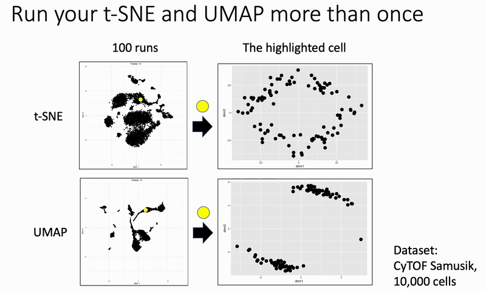

# Variability in t-SNE and UMAP: Tracking a Single Cell Across 100 Runs

This project explores the stochasticity of dimensionality reduction methods like **t-SNE** and **UMAP** when applied repeatedly to the same dataset. Using the Samusik bone marrow CyTOF dataset (10,000 cells), we track the position of a single cell across **100 runs** of each algorithm.

Key takeaway: _Run your dimensionality reductions multiple times._ The layout is not fixed, and conclusions should focus on patterns that persist across runs.

## Summary

- **t-SNE** shows a diffuse ring-like distribution of the cell's position across runs, indicating many plausible layouts.
- **UMAP** is more constrained, with the cell jumping between two dominant regions.
- These patterns inform how we interpret dimensionality reduction in single-cell data, particularly in terms of island stability vs. layout reliability.

<p align="center">
  
</p>

## Project Structure

```text
.
├── src/                  # R scripts and notebooks for analysis
├── output/               # Generated results, gifs, and RDS files
